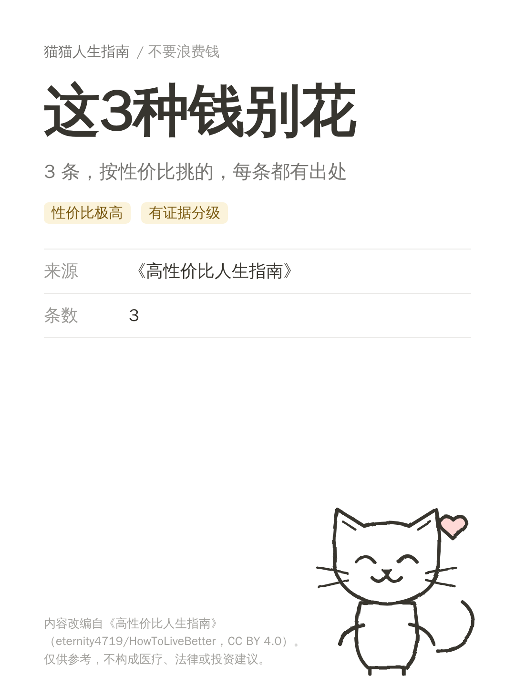
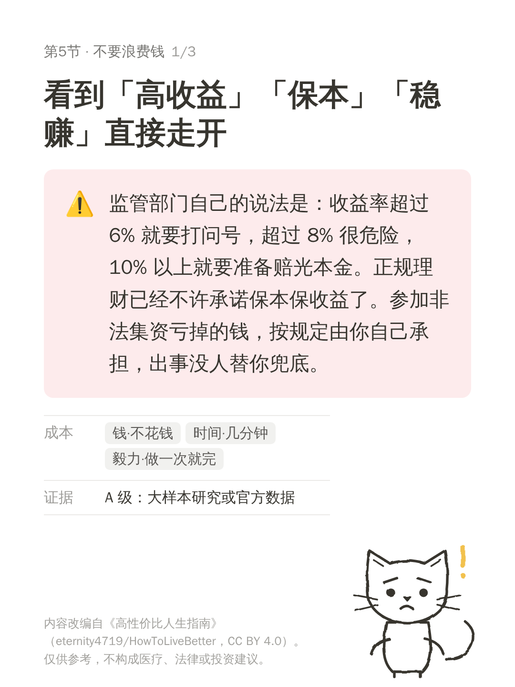

# 小红书账号：猫咪 Notion 风「高性价比人生指南」

用一只简笔画猫，把[《高性价比人生指南》](https://github.com/eternity4719/HowToLiveBetter)里 665 条带证据分级的建议，做成小红书图文卡片，目标是可验证的变现。

 

> 示例在云端容器渲染，字体是文泉驿，比你本机的 PingFang/雅黑丑。正式发布请在本机渲染。

## 30 秒上手

```bash
pip install -r requirements.txt
python tools/build_pool.py                                  # 上游 → content/pool.json
python tools/make_post.py --list --risk low --ratio 极高     # 挑选题
python tools/make_post.py --slug save-01 --title "这3种钱别花" 05-06 05-45 14-01
python tools/render_cards.py content/posts/save-01.json      # → output/save-01/*.png
```

## 目录

| 路径 | 内容 |
|---|---|
| `docs/01-strategy.md` | 定位、变现分层、风险、20 篇实验。**先读这个** |
| `docs/06-positioning.md` | **当前定位与选材方向**（取代 01 的定位句），首批 10 个选题映射 |
| `research/codex-benchmark-brief.md` | **给 Codex 的第二轮对标搜索任务单**（含搜索关键词、入样标准、安全约束） |
| `research/account-analysis-2026-10-05.md` | Codex 对两个对标账号的拆解 |
| `docs/02-competitor-research.md` | 用 xiaohongshu-mcp 做对标研究的 SOP |
| `docs/03-content-system.md` | 选题 → 卡片 → 正文 → 发布前检查清单 |
| `docs/04-visual-style.md` | 猫角色与 Notion 视觉规范 |
| `docs/05-setup.md` | xiaohongshu-mcp / Context7 安装 |
| `docs/video-notes.md` | 指导视频（**正文未读到**，待补） |
| `tools/` | `build_pool` / `make_post` / `render_cards` / `cat` |
| `content/` | `pool.json`（选题池）、`posts/`（草稿） |
| `research/` | 对标与发文记录 CSV |
| `.mcp.json` | MCP 配置 |

## 状态

| 项 | 状态 |
|---|---|
| 内容流水线（选题→卡片） | 已跑通，demo 已渲染 |
| 指导视频方法论 | **未读到正文**，需你贴字幕 |
| 对标研究 | 未做：需在你本机跑 xiaohongshu-mcp |
| 海外身份变现可行性 | **未知，最优先核实** |
| 猫的名字与性格 | 待你定 |

## 内容许可

书的内容 CC BY 4.0，必须署名（卡片和正文已自动带）；上游代码 MIT。`content/pool.json` 是上游内容的结构化副本，沿用 CC BY 4.0。本仓库自身的代码许可尚未选定（没有 LICENSE 文件），由你决定。
